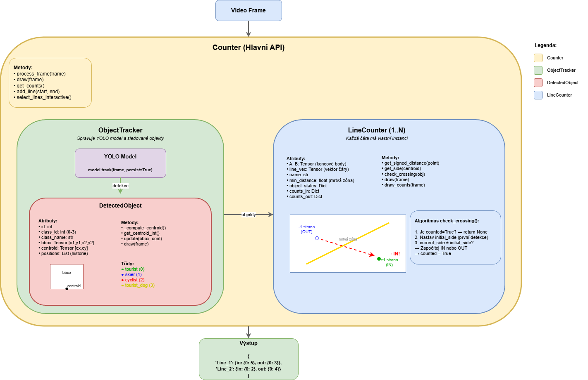
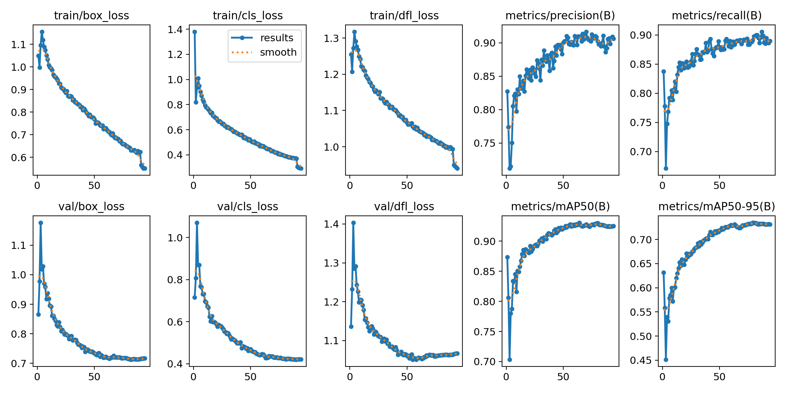
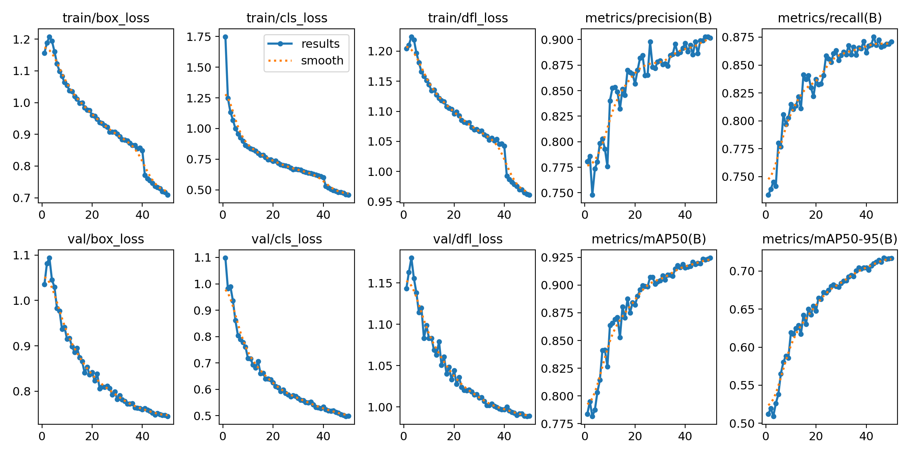

# Obrazová detekce návštěvníků na Jizerské magistrále

- tento repozitář slouží jako podpora bakalářské práce zaměřené na detekci a počítání návštěvníků na Jizerské magistrále pomocí počítačového vidění a strojového učení.

Systém pro automatické počítání průchodů objektů přes definované čáry ve videu pomocí YOLO detekce a trackingu.

## Funkce

- Detekce a tracking objektů (turisté, lyžaři, cyklisté, psi)
- Počítání průchodů přes jednu nebo více čar
- Rozlišení směru (IN/OUT)
- Vizualizace trajektorií a počtů
- Export anotovaného videa

## Třídy objektů

| ID | Třída | Barva |
|----|-------|-------|
| 0 | tourist | Zelená |
| 1 | skier | Červená |
| 2 | cyclist | Modrá |
| 3 | tourist_dog | Žlutá |


## Použití

### Konfigurace
Je potřeba nastavit hodnoty v `conf.yaml`. Příklad struktury souboru lze nalézt v `conf.example.yaml`.

### Virtuální prostředí
```bash
python -m venv .venv
source .venv/bin/activate  # Linux/Mac
.venv\Scripts\activate   # Windows
pip install -r requirements.txt
```

### Spuštění
```bash
python -m src.main <video_filename>
```

nebo bez argumentu pro výchozí video:
```bash
python -m src.main
```

## Architektura



- **Hierarchie tříd** - `Counter` jako hlavní API zapouzdřuje `ObjectTracker` (správa YOLO detekce) a jeden či více `LineCounter` (počítání průchodů), přičemž každý sledovaný objekt je reprezentován třídou `DetectedObject`
- **Tok dat** - video frame vstupuje do `ObjectTracker`, kde YOLO model detekuje objekty a přiřazuje jim unikátní ID; ty jsou následně předány všem `LineCounter` instancím, které nezávisle vyhodnocují průchody přes své čáry
- **Logika počítání** - diagram vizualizuje, jak `LineCounter` určuje stranu objektu vůči čáře (±1) pomocí znaménkové vzdálenosti a započítává průchod (IN/OUT) při změně strany mimo mrtvou zónu

## Struktura projektu
```
counter/
├── src/
│   ├── main.py
│   └── models/
│       ├── Counter.py
│       ├── LineCounter.py
│       ├── ObjectTracker.py
│       └── DetectedObject.py
├── models/
│   └── yolov5n_v2/
│           └── weights/
│               └── best.pt
└── data/
    └── videos/
```

## Výsledky trénování
modely byly trénovány na datasetu složeném z vlastních záznamů a veřejně dostupných datasetů s anotacemi pro třídy turistů, lyžařů, cyklistů a psů. Tréninková sada obsahovala přes 9000 anotovaných obrázků.


### YOLOv8s


### YOLOv5n

