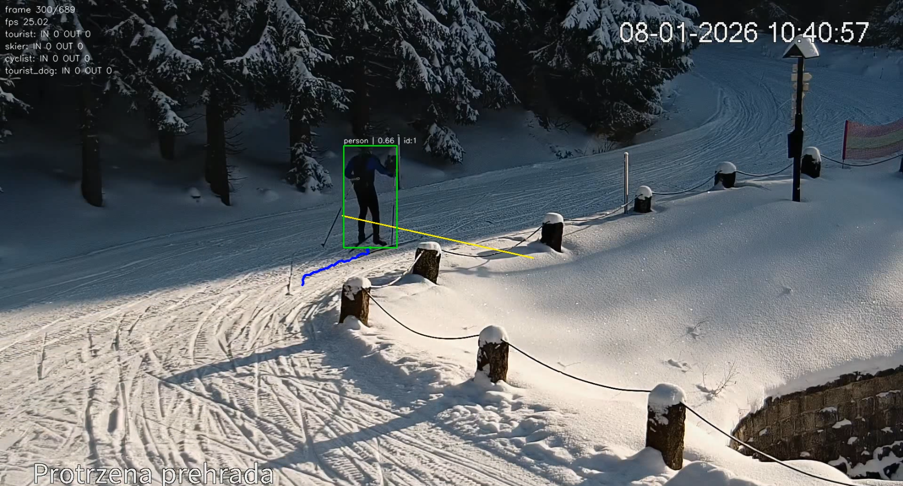

# Popis projektu

Projekt slouží k automatickému počítání průchodů objektů ve videu. Prakticky jde o nástroj, který vezme vstupní záznam, provede detekci objektů, sleduje jejich pohyb mezi snímky a zaznamená, kdy dojde k překročení předem definované čáry.

Primární použití projektu je v doméně sledování návštěvnosti na Jizerské magistrále. Systém je navržen tak, aby uměl rozlišovat vybrané kategorie návštěvníků a vytvářel výstupy, které lze dále vyhodnocovat nebo porovnávat s referenčními hodnotami.

Součástí projektu je také evaluace výsledků a jednoduché webové rozhraní. Díky tomu lze řešení použít jak pro praktické spuštění nad konkrétním videem, tak pro kontrolu kvality modelů a interpretaci výsledků.

## Návaznost
- Předchozí část: [Cíl řešení](./01_cil_reseni.md)
- Další část: [Vstupy a výstupy](./03_vstupy_a_vystupy.md)
