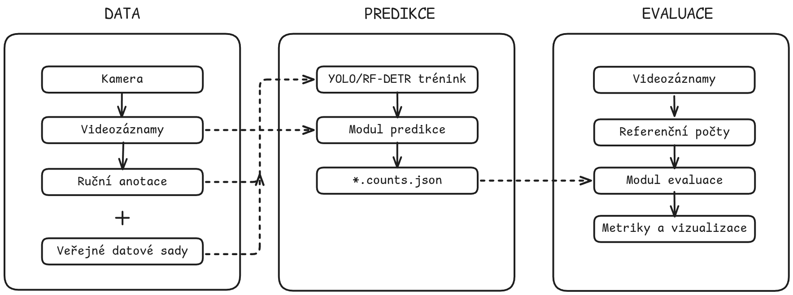

# Hlavní části systému

Systém lze rozdělit do tří hlavních částí. Každá z nich řeší jinou fázi práce s daty, ale společně tvoří jeden navazující celek od zpracování videa až po interpretaci výsledků.

## Predikční pipeline
- Zpracování videa modelem.
- Tracking objektů.
- Určení průchodů přes zadanou čáru.

Predikční pipeline představuje hlavní výpočetní část systému. Jejím úkolem je načíst video, získat detekce objektů, sledovat jejich pohyb a převést tento pohyb na počty průchodů přes vybranou čáru.

## Evaluace výsledků
- Porovnání predikce s referenční hodnotou.
- Vyhodnocení chyb a metrik.

Evaluace slouží k ověření kvality výsledků. Porovnává výstupy predikce s referenčními daty a vypočítává metriky, které ukazují, jak přesně model odpovídá skutečným počtům průchodů.

## Webové rozhraní
- Výběr modelu a videa.
- Nastavení čáry.
- Spuštění a kontrola běhu.

Webové rozhraní zpřístupňuje hlavní funkce systému uživateli bez nutnosti pracovat v příkazové řádce. Zpřístupňuje výběr vstupních dat, spuštění běhu a kontrolu výsledků.

## Návaznost
- Předchozí část: [Vstupy a výstupy](./03_vstupy_a_vystupy.md)
- Další část: [Omezení a předpoklady](./05_omezeni_a_predpoklady.md)
