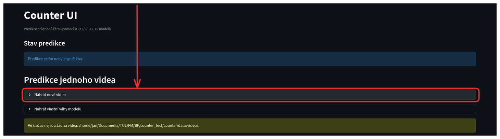

# Nahrání videa

Nahrajte video podle těchto kroků:

1. Připravte si video ve formátu MP4, AVI, MOV, MKV nebo MPEG4 menší než 20 GB.

2. V sekci pro výběr videa klikněte na tlačítko pro nahrání videa.

3. Klikněte na šedé tlačítko pro výběr videa a vyberte soubor.

4. Počkejte na nahrání a potvrďte výběr kliknutím na tlačítko "Nahrát a vybrat". Nahrát lze vždy pouze jedno video.

Po úspěšném nahrání se zobrazí potvrzující hláška a video bude připraveno k výběru v sekci níže.

- [Další část: Nahrání modelu](./02_nahrani_modelu.md)
- [Zpět na přehled návodu](../index.md)
