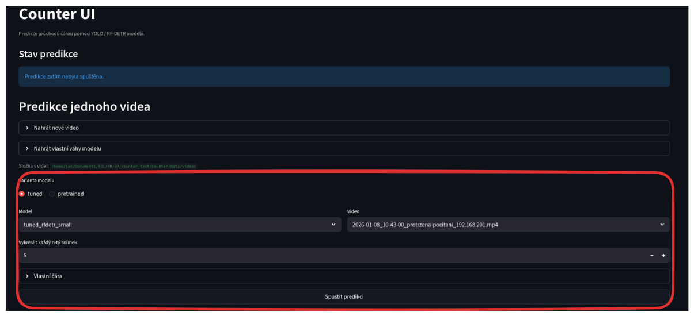
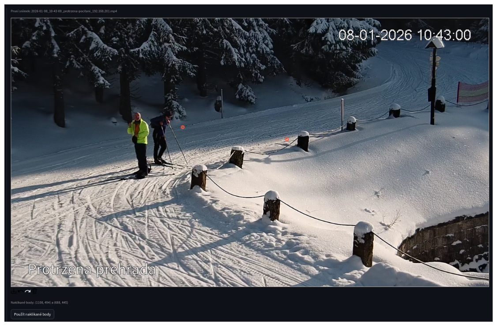
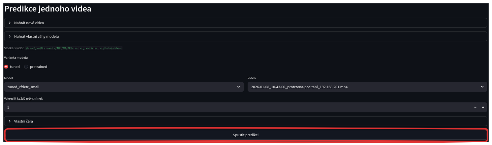
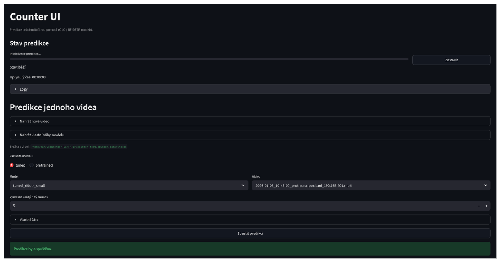

# Spuštění predikce

Na stránce najděte sekci pro výběr modelu a videa.

Nastavte tyto položky:

- **Varianta modelu** — Pro vlastní natrénovaný model zvolte `tuned`. Pro předtrénovaný model zvolte `pretrained`.
- **Model** — Zvolte model pro predikci.
- **Video** — Zvolte video ke zpracování. Prázdný seznam znamená, že musíte nejprve nahrát video — postupujte podle [návodu k nahrání videa](./01_nahrani_videa.md).
- **Vykreslit každý n-tý snímek** — Určuje jemnost výsledného videa. Výchozí hodnota 5 vykreslí každý pátý snímek.
- **Vlastní čára** — Nastavte vlastní polohu čáry pro počítání průchodů.

## Nastavení vlastní čáry

Klikněte na tlačítko "Vlastní čára" pro rozbalení nabídky.

*Poznámka: před načtením prvního snímku videa proveďte znovunačtení stránky (`CTRL + R`).*

Zvolte jeden ze dvou způsobů nastavení:

1. **Zadejte souřadnice ručně** — Zadejte přesné souřadnice začátku a konce čáry ve formátu `x,y` (např. `100,200`) a vyplňte rozlišení videa.
2. **Nastavte čáru nad prvním snímkem videa (doporučeno)** — Klikněte na tlačítko "Nastavit čáru nad prvním snímkem videa". Načte se první snímek zvoleného videa a zobrazí se nástroj pro nastavení čáry.

Prvním kliknutím označte místo, kde má čára začínat. Druhým kliknutím označte místo, kde má čára končit.

Klikněte na tlačítko "Použít naklikané body" pro potvrzení nastavení čáry.

## Spuštění

Po nastavení všech parametrů klikněte na tlačítko "Spustit predikci".

## Průběh predikce

Po spuštění predikce se zobrazí průběh běhu.

V horní části se zobrazuje aktuální stav běhu, počet zpracovaných snímků, stav, zařízení, zpracovávané video a uplynulý čas. Pro kontrolu průběhu zobrazte detailní logy z běhu.

Po dokončení běhu se stav změní na "dokončeno".

- [Předchozí část: Nahrání modelu](./02_nahrani_modelu.md)
- [Další část: Kontrola výsledků predikce](./04_kontrola_vysledku.md)
- [Zpět na přehled návodu](../index.md)
