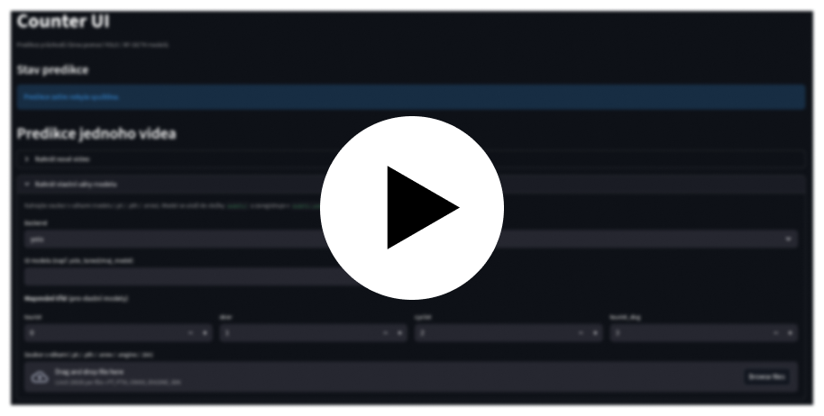

# Jak spustit webové rozhraní pro provedení predikce na videu

Tento návod popisuje nejjednodušší způsob práce se systémem přes webové rozhraní. Postup je vhodný pro uživatele, kteří chtějí vybrat video, nastavit čáru a zkontrolovat výsledky bez práce s příkazovou řádkou.

## Předpoklady
Připravte prostředí projektu:

1. Nainstalujte Python 3.10+ a Git.
2. Nainstalujte správce prostředí `uv` podle [instalačního návodu (README)](../../README.md).
3. Naklonujte repozitář a synchronizujte prostředí:

```bash
git clone https://github.com/janhorak58/counter.git
cd counter
uv sync
```

Spusťte webové rozhraní:

```bash
uv run counter-ui
```

Otevřete prohlížeč a přejděte na adresu [`http://localhost:8501`](http://localhost:8501). Zobrazí se úvodní obrazovka.


# Další kroky

## Nahrání videa a modelu
Po otevření rozhraní jsou k dispozici pouze předtrénované modely a žádná videa.

Pro zpracování vlastního videa nebo použití vlastního modelu nejprve nahrajte video nebo model:

1. [Nahrání videa](./01_nahrani_videa.md)
2. [Nahrání modelu](./02_nahrani_modelu.md)

## Spuštění predikce a kontrola výsledků
Po nahrání videa a modelu přejděte k nastavení čáry a spuštění predikce:

3. [Spuštění predikce](./03_predikce.md)
4. [Kontrola výsledků predikce](./04_kontrola_vysledku.md)

# Video návod
Podívejte se na krátký video návod od spuštění rozhraní po kontrolu výsledků.

[](https://youtu.be/64PHaxcjUcU)
