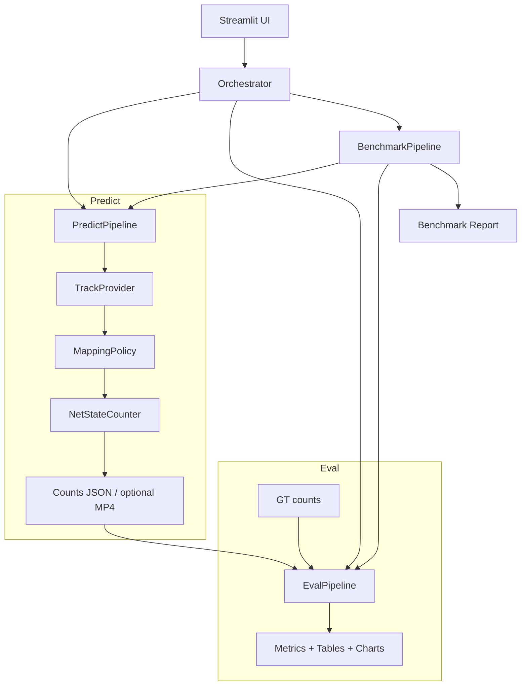

```mermaid
flowchart TB
  UI[Streamlit UI] --> ORCH[Orchestrator]

  ORCH --> PRED[PredictPipeline]
  ORCH --> EVAL[EvalPipeline]
  ORCH --> BENCH[BenchmarkPipeline]

  subgraph Predict
    PRED --> TP[TrackProvider]
    TP --> MAP[MappingPolicy]
    MAP --> CNT[NetStateCounter]
    CNT --> OUTP[Counts JSON / optional MP4]
  end

  subgraph Eval
    GT[GT counts] --> EVAL
    OUTP --> EVAL
    EVAL --> MET[Metrics + Tables + Charts]
  end

  BENCH --> PRED
  BENCH --> EVAL
  BENCH --> REP[Benchmark Report]
```
