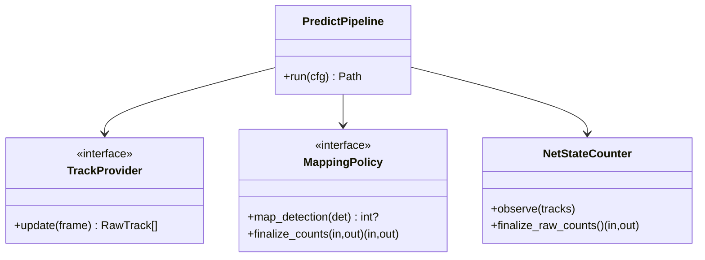

```mermaid
classDiagram
  class PredictPipeline {
    +run(cfg) Path
  }
  class TrackProvider {
    <<interface>>
    +update(frame) RawTrack[]
  }
  class MappingPolicy {
    <<interface>>
    +map_detection(det) int?
    +finalize_counts(in,out) (in,out)
  }
  class NetStateCounter {
    +observe(tracks)
    +finalize_raw_counts() (in,out)
  }

  PredictPipeline --> TrackProvider
  PredictPipeline --> MappingPolicy
  PredictPipeline --> NetStateCounter
```